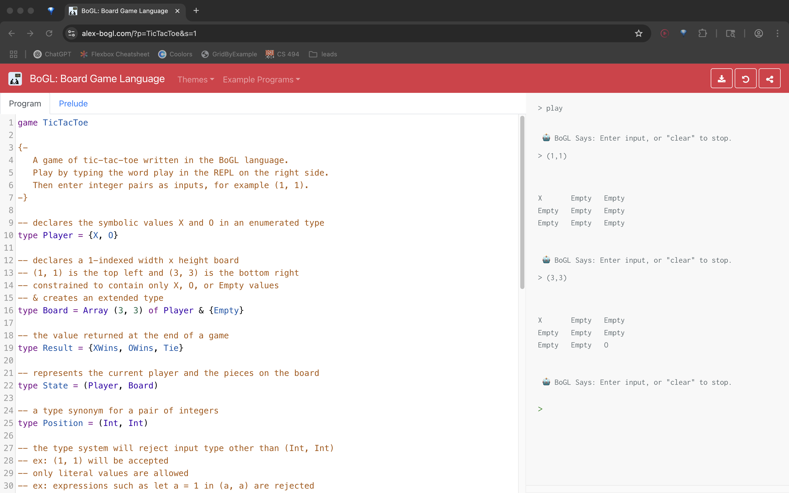

This project is hosted at [https://alex-bogl.com/](https://alex-bogl.com/).

BoGL is an interpreted educational domain-specific programming language. It was developed between 2019 - 2021 and used in middle school and Oregon State University introductory computer science classes. alex-bogl is a fork of the [original project](https://github.com/ChildsplayOSU).
